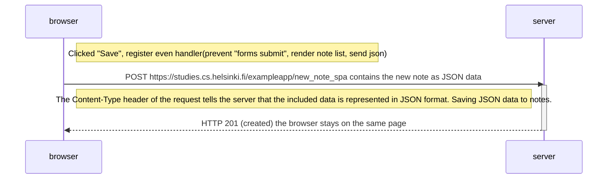

```mermaid
sequenceDiagram
    participant browser
    participant server 

    Note right of browser: Clicked "Save", register even handler(prevent "forms submit", render note list, send json)
    browser->>server: POST https://studies.cs.helsinki.fi/exampleapp/new_note_spa contains the new note as JSON data
    activate server

    Note left of server: The Content-Type header of the request tells the server that the included data is represented in JSON format. Saving JSON data to notes.


    server-->>browser: HTTP 201 (created) the browser stays on the same page
    deactivate server


```